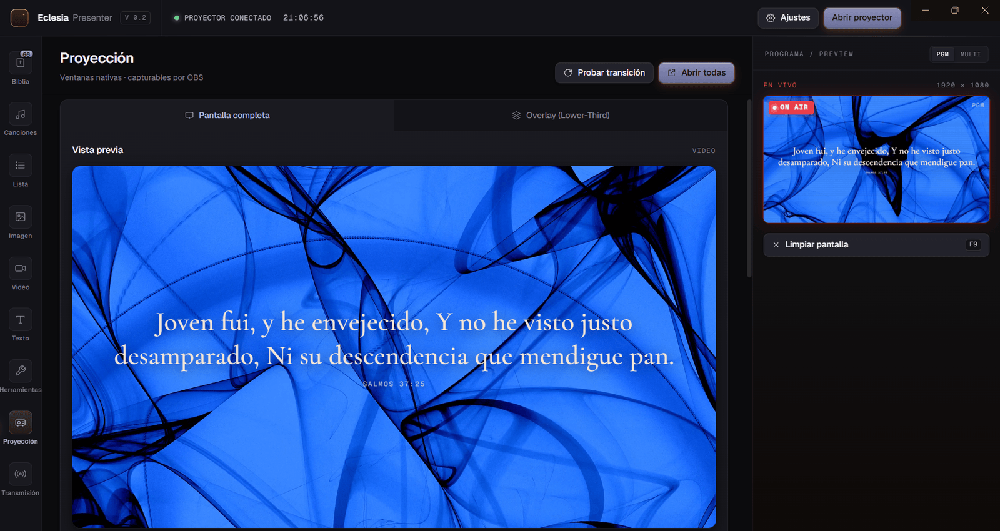
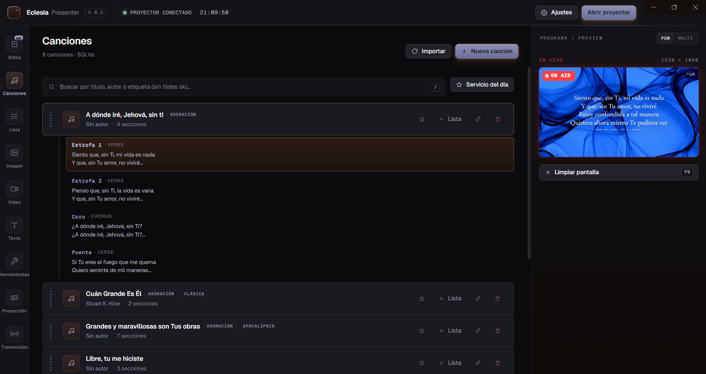
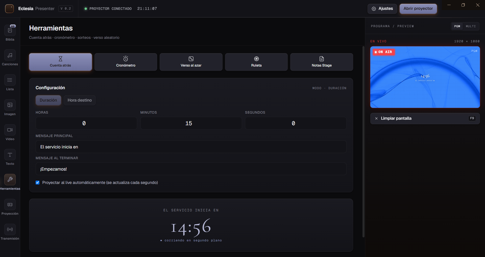
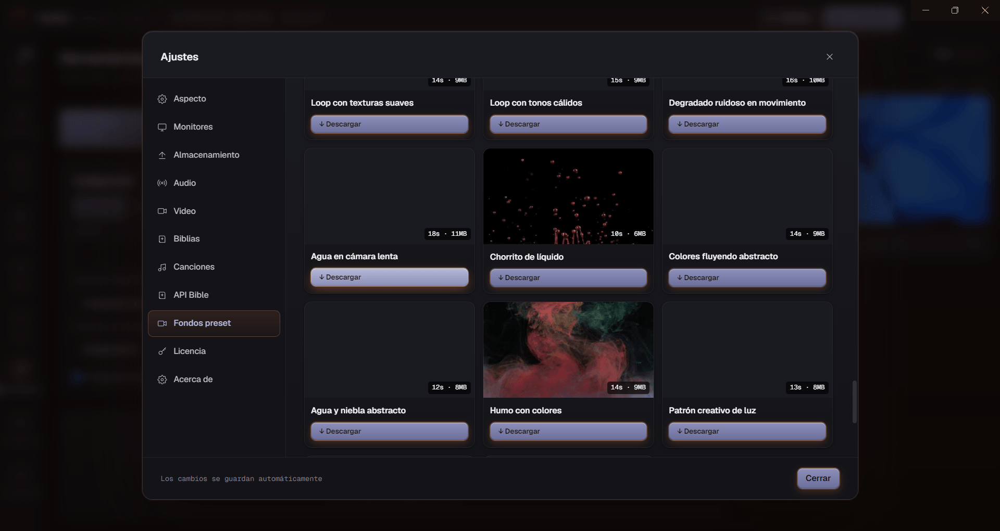

# EclesiaPresenter

**Proyección bíblica y de alabanza para tu iglesia — simple, elegante y en español.**

 

*Así se ve un versículo proyectado con EclesiaPresenter.*

---

## ✨ ¿Qué es EclesiaPresenter?

EclesiaPresenter es un software de presentación pensado **desde cero para iglesias hispanohablantes**: proyecta versículos, letras de canciones y anuncios con un diseño cuidado, sin pelearte con plantillas de PowerPoint a mitad del servicio. Escribe `juan 3 16` y está en pantalla en un segundo.

| | |
|---|---|
| 📖 **Biblia completa, 10 versiones** | RVR1960, RV2020, NVI, NTV, DHH, LBLA, TLA, NBV, PDT y RVR1909 — sin internet. |
| 🔍 **Búsqueda inteligente** | Por referencia (`salmos 23`, `1 co 13 4-7`, abreviaturas con o sin tildes) o por texto del versículo. |
| 🎵 **Biblioteca de canciones** | Secciones (verso / coro / puente), búsqueda instantánea e importación desde Holyrics. |
| 📋 **Lista del día** | Prepara el orden del servicio y proyecta cada elemento con un clic. |
| 🖥️ **Proyección profesional** | Segunda pantalla o overlay transparente para **OBS** (Browser Source) con fondos artísticos. |
| 📱 **Mando a distancia** | Controla todo desde el teléfono: pasar diapositivas, lanzar versículos y canciones. |
| ⏱️ **Herramientas en vivo** | Cuenta regresiva, pantalla en negro/blanco, anuncios rápidos y botón de pánico. |
| 🌐 **Multi-idioma** | Español · English · Português. |

---

## 🖥️ La aplicación

*Panel de proyección: vista previa, control **EN VIVO** y diapositivas siempre a mano.*

 

|  |  |
|:---:|:---:|
| **Editor de canciones** con secciones y etiquetas | **Cuenta regresiva** para antes del servicio |

|  |  |
|:---:|:---:|
| **Fondos personalizables** por tipo de contenido | **Resultado final** que ve tu congregación |

---

## 📥 Descargas

| Plataforma | Archivo | Notas |
|---|---|---|
| 🪟 **Windows** (recomendado) | [`EclesiaPresenter-setup.exe`](https://github.com/Juanalejo01/eclesia-presenter/releases/latest) | Instalador con **actualizaciones automáticas** |
| 🪟 **Windows portable** | [`EclesiaPresenter-portable.exe`](https://github.com/Juanalejo01/eclesia-presenter/releases/latest) | Sin instalación — ideal para USB |
| 🍎 **macOS** (Apple Silicon) | [`EclesiaPresenter-arm64.zip`](https://github.com/Juanalejo01/eclesia-presenter/releases/latest) | Descomprimir y arrastrar a Aplicaciones |
| 🤖 **Android** (mando móvil) | [`Releases mobile-v*`](https://github.com/Juanalejo01/eclesia-presenter/releases?q=mobile&expanded=true) | APK del mando a distancia |

> 🔄 La versión de escritorio **se actualiza sola**: cuando hay una versión nueva, la app te avisa y tú decides cuándo instalarla.

---

## 📱 Mando a distancia desde el móvil

Controla la proyección sin estar sentado frente al PC:

1. Abre EclesiaPresenter en el PC y ve a **Transmisión → Control remoto**.
2. En el teléfono, entra a la dirección que muestra la app (o escanea el QR) — o instala el APK de Android.
3. Introduce el **PIN de 6 dígitos** y listo.

Pasar diapositivas, buscar versículos, lanzar canciones, pantalla en negro… todo desde la palma de la mano. Funciona por **red local (WiFi)**, sin necesidad de internet.

---

## 🛟 Soporte

- 🐛 ¿Encontraste un fallo o tienes una idea? [Abre un issue](https://github.com/Juanalejo01/eclesia-presenter/issues) — se lee todo.
- 📦 Historial de cambios en las [notas de cada versión](https://github.com/Juanalejo01/eclesia-presenter/releases).

---

Este repositorio contiene las **descargas oficiales y novedades** de EclesiaPresenter. 
El código fuente se desarrolla en un repositorio privado.

Hecho con ❤️ para la iglesia hispanohablante.

**© 2026 Juanalejo01 — Todos los derechos reservados.**

